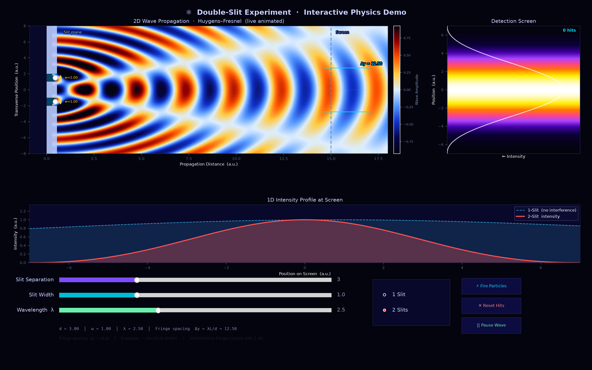

# Interactive Double-Slit Experiment

An educational visualization of wave propagation, diffraction, interference,
and probabilistic particle detection. It includes:

- a rich Python/Matplotlib desktop simulation;
- a zero-install browser demo designed for GitHub Pages;
- one-slit and two-slit comparison;
- adjustable slit separation, slit width, and wavelength;
- an accumulating photon-hit view sampled from the intensity distribution.



## Live demo

After enabling GitHub Pages, the demo will be available at:

`https://<your-github-username>.github.io/<repository-name>/`

The Pages workflow is already included. In the GitHub repository, open
**Settings → Pages**, set **Source** to **GitHub Actions**, then push `main`.

## Run locally

Requires Python 3.10 or newer.

```bash
python -m venv .venv
source .venv/bin/activate       # Windows: .venv\Scripts\activate
python -m pip install -r requirements.txt
python slit.py
```

The application opens an interactive window and writes `double_slit.png` as a
static preview. To preview the website locally:

```bash
python -m http.server 8000 --directory docs
```

Then visit <http://localhost:8000>.

## Physics model

Each slit is treated as a coherent cylindrical source. The animated field uses

```text
ψ(x, y, t) = Σ cos(krᵢ − ωt) / √rᵢ
```

The detector uses complex amplitude superposition with a finite-width
single-slit envelope:

```text
I(y) ∝ |Σ sinc(w sinθ / λ) exp(ikrᵢ) / √rᵢ|²
```

In the far-field, adjacent bright fringes are approximately separated by
`Δy = λL/d`. Values are in arbitrary units, so this is a conceptual simulation
rather than a calibrated laboratory model. See [the model notes](docs/PHYSICS.md)
for assumptions and limitations.

## Repository map

| Path | Purpose |
| --- | --- |
| `slit.py` | Interactive Matplotlib double-slit simulation |
| `docs/` | Browser demo and physics notes published by GitHub Pages |
| `double_slit.png` | Static social/README preview |
| `.github/workflows/pages.yml` | GitHub Pages deployment |

## Ideas that would make this an exceptional demo

See [IMPROVEMENTS.md](IMPROVEMENTS.md) for a prioritized roadmap. The highest
impact additions are a guided lesson mode, dimensionally correct SI presets,
single-photon time-lapse experiments, phase/coherence controls, and automated
physics regression tests.

## Contributing

Small, focused pull requests are welcome. Please explain the physics or UX
motivation, test the Python app, and verify the browser demo at mobile and
desktop widths. By contributing, you agree that your work is licensed under
the [MIT License](LICENSE).
